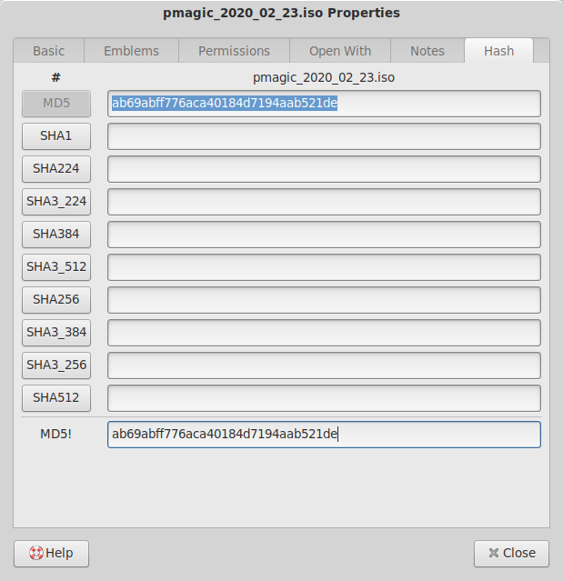

caja-hash-tab
=============

This little tool adds a "Hash" tab to your Caja file manager.
It allows you to calculate the md5 or sha1 hash of a file
in the properties dialog of Caja.

Installation
------------

An easily installable package will be added (here) in the future.
Until then, you can install caja-hash-tab manually.

To install it manually, copy it into your home directory:

    $ mkdir -p ~/.local/share/caja-python/extensions/
    $ cp caja-hash-tab.py /home/philip/.local/share/caja-python/extensions/

And you may have to install `python3-caja`:

    # dnf install python3-caja

Author
------

Philip Seeger (philip@c0xc.net)

License
-------

Please see the file called LICENSE.

